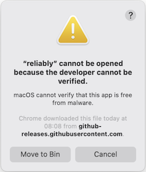
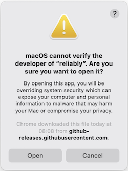
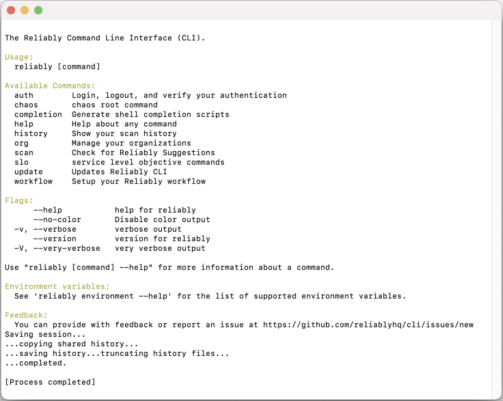
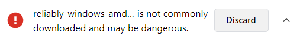

import Tab from '~/components/Tab.vue'
import Tabs from '~/components/Tabs.vue'
import CopyToClipboard from '~/components/MarkdownCopyToClipboard.vue'

[Releases]: https://github.com/reliablyhq/cli/releases/
[macOS Release]: https://github.com/reliablyhq/cli/releases/latest/download/reliably-darwin-amd64
[Linux Release]: https://github.com/reliablyhq/cli/releases/latest/download/reliably-linux-amd64
[Windows Release]: https://github.com/reliablyhq/cli/releases/latest/download/reliably-windows-amd64
[macOS Checksum]: https://github.com/reliablyhq/cli/releases/latest/download/reliably-darwin-amd64.md5
[Linux Checksum]: https://github.com/reliablyhq/cli/releases/latest/download/reliably-linux-amd64.md5
[Windows Checksum]: https://github.com/reliablyhq/cli/releases/latest/download/reliably-windows-amd64.md5

# Installing the Reliably CLI

## Quick Install Guide

This guide explains the streamlined process of installing the Reliably CLI and
taking the first steps to incorporate reliability best practices into your
current workflow. Alternatively, you may prefer to
[manually install](#manual-install-guide) the Reliably CLI or work with a
[kubectl plugin](#kubectl-plugin-guide) instead

<Tabs>
<Tab name="macOS" selected="true">

### macOS

Download the latest executable for `macOS` into a directory in your PATH - for
example: `/usr/local/bin`

```console
curl -L https://github.com/reliablyhq/cli/releases/latest/download/reliably-darwin-amd64 -o /usr/local/bin/reliably --create-dirs
```

<CopyToClipboard />

Make it executable:

```console
chmod +x /usr/local/bin/reliably
```

<CopyToClipboard />

To ensure that everything is working, you can use `reliably --version`:

```console
reliably --version
```

<CopyToClipboard />

```text
Reliably CLI version x.x.x (yyyy-mm-dd)
```

Now you're all set to [login](../login/)

</Tab>
<Tab name="Linux">

### Linux

Download the latest executable for `Linux` into a directory in your PATH - for
example: `/usr/local/bin`

```console
curl -L https://github.com/reliablyhq/cli/releases/latest/download/reliably-linux-amd64 -o /usr/local/bin/reliably --create-dirs
```

<CopyToClipboard />

Make it executable:

```console
chmod +x /usr/local/bin/reliably
```

<CopyToClipboard />

To ensure that everything is working, you can use `reliably --version`:

```console
reliably --version
```

<CopyToClipboard />

```text
Reliably CLI version x.x.x (yyyy-mm-dd)
```

Now you're all set to [login](../login/)

</Tab>
<Tab name="Windows">

### Windows

Download the latest executable for `Windows` into a directory in your HOMEPATH -
for example: `/bin`

```console
curl -L https://github.com/reliablyhq/cli/releases/latest/download/reliably-windows-amd64 -o %HOMEDRIVE%%HOMEPATH%/bin/reliably.exe --create-dirs
```

<CopyToClipboard />

:::important
This guide assumes you have the `curl` command available. `curl` is available as
a Windows 10 command after version 1706. For other versions of Windows, you can
[download curl](https://curl.se/download.html) from the official curl website.
:::

Edit the system environment variables:

- Go to Settings > System > About > Advanced system settings
- Select "Environment Variables ..."
- Select the "Path" variable of the "User variables"
- Select "Edit..."
- Select "Browse..."
- Navigate to the executable's directory
- Select "OK"

To ensure that everything is working, you can use `reliably --version`:

```console
reliably --version
```

<CopyToClipboard />

```text
Reliably CLI version x.x.x (yyyy-mm-dd)
```

Now you're all set to [login](../login/)

</Tab>
</Tabs>

## Manual Install Guide

This guide explains the in-depth process of manually installing the Reliably CLI
to support continuous application reliability throughout your SDLC.
Alternatively, you may prefer to install the Reliably CLI as a
[kubectl plugin](#kubectl-plugin-guide) or work with a
[previous version](#previous-versions) instead

<Tabs>
<Tab name="macOS" selected="true">

### macOS

You can [download the latest macOS release][macOS Release] from your browser.
To make Reliably convenient to run, rename the executable to `reliably` and move
it to a directory in your PATH - for example: `/usr/local/bin`

If you want to check the file has not been corrupted, you can
[download the latest macOS checksum][macOS Checksum] and compare it to the `md5`
checksum. If needed, change the path to match the location you chose:

```console
md5 /usr/local/bin/reliably
```

<CopyToClipboard />

```text
MD5 (/usr/local/bin/reliably) = cab791d7d4b4e5a0dcf00392b4ce672c
```

Now you can make the file executable. If needed, change the path to match the
location you chose:

```console
chmod +x /usr/local/bin/reliably
```

<CopyToClipboard />

To ensure that everything is working, you can use `reliably --version`:

```console
reliably --version
```

<CopyToClipboard />

```text
Reliably CLI version x.x.x (yyyy-mm-dd)
```

When you run this command, macOS might display a warning as follows - although
it may look different if you're running macOS Big Sur or newer:



To get around this, navigate to the executable's directory in your PATH, select
the executable, Control + Click it, select "Open" and the following warning will
appear:



Select `Open` and a terminal window will pop-up showing:



The app will be saved as an exception to your security settings and you will now
be able to run it from the command line.

Now you're all set to [login](../login/)

</Tab>
<Tab name="Linux">

### Linux

You can [download the latest Linux release][Linux Release] from your browser.
To make Reliably convenient to run, rename the executable to `reliably` and move
it to a directory in your PATH - for example: `/usr/local/bin`

If you want to check the file has not been corrupted, you can
[download the latest Linux checksum][Linux Checksum] and compare it to the `md5`
checksum. If needed, change the path to match the location you chose:

```console
md5sum reliably
```

<CopyToClipboard />

```text
cab791d7d4b4e5a0dcf00392b4ce672c  reliably
```

Now you can make the file executable. If needed, change the path to match the
location you chose:

```console
chmod +x /usr/local/bin/reliably
```

<CopyToClipboard />

To ensure that everything is working, you can use `reliably --version`:

```console
reliably --version
```

<CopyToClipboard />

```text
Reliably CLI version x.x.x (yyyy-mm-dd)
```

Now you're all set to [login](../login/)

</Tab>
<Tab name="Windows">

### Windows

You can [download the latest Windows release][Windows Release] from your browser
which may prompt the following warning:



Here, you can just select the uptick and choose to "Keep" the download

To make Reliably convenient to run, rename the executable to `reliably` with the
`.exe` file extension and move it to a directory in your PATH - for example:
`\bin`

If you want to check the file has not been corrupted, you can
[download the latest Windows checksum][Windows Checksum] and compare it to the
`md5` checksum using Windows Powershell. If needed, change the path to match the
location you chose:

```powershell
 Get-FileHash .\bin\reliably.exe -algorithm md5
```

<CopyToClipboard />

```text
Algorithm           Hash
---------           ----
MD5                 cab791d7d4b4e5a0dcf00392b4ce672c
```

To ensure that everything is working, you can use `.\bin\reliably.exe --version`.
If needed, change the path to match the location you chose:

```powershell
.\bin\reliably.exe --version
```

<CopyToClipboard />

```text
Reliably CLI version x.x.x (yyyy-mm-dd)
```

However, using `reliably` with the prefix `.\bin\reliably.exe` isn't too useful
but luckily we can change this with some environment variables.
To alter this, you can:

- Go to Settings > System > About > Advanced system settings
- Select "Environment Variables ..."
- Select the "Path" variable of the "User variables"
- Select "Edit..."
- Select "Browse..."
- Navigate to the executable's directory
- Select "OK"

To ensure that everything is working, you can use `reliably --version` in a new
Powershell window:

```powershell
reliably --version
```

<CopyToClipboard />

```text
Reliably CLI version x.x.x (yyyy-mm-dd)
```

Now you're all set to [login](../login/)

</Tab>
</Tabs>

## Kubectl Plugin Guide

If you use [`kubernetes`][kubernetes] clusters to containerise your application,
you may prefer to install `reliably` as a `kubectl` plugin instead. The
[`kubectl`][kubectl] command-line tool allows you to interact with your
`kubernetes` clusters to be able to mantain and manage them. Plugins extend
`kubectl` with new sub-commands, allowing for custom features not included in
the main distribution of `kubectl`

[kubernetes]: https://kubernetes.io/docs/home/
[kubectl]: https://kubernetes.io/docs/reference/kubectl/overview/

### Install Directly

To install `reliably` as a `kubectl` plugin, follow either the
[Quick Install Guide](#quick-install-guide) or the
[Manual Install Guide](#manual-install-guide) and replace the executable's
filename with `kubectl-reliably` instead

Alternatively, you can use `krew`

### Install as a Krew Plugin

[Krew][krew] is an open-source plugin manager maintained by
the [Kubernetes SIG CLI][sigcli] community. If you don't already have `krew`
installed, we recommend you follow the [krew install guide][krew-install]. Once
installed, you can install the `reliably` plugin with:

[krew]: https://krew.sigs.k8s.io/
[sigcli]: https://github.com/kubernetes/community/tree/master/sig-cli
[krew-install]: https://krew.sigs.k8s.io/docs/user-guide/setup/install/

```console
kubectl krew install reliably
```

<CopyToClipboard />

To ensure that everything is working, you can use `kubectl reliably --version`:

```console
kubectl reliably --version
```

```text
Reliably CLI version x.x.x (yyyy-mm-dd)
```

Now you're all set to [login](../login/)

## Previous Versions

To install a previous release, you can use the following:

```console
reliably update --version x.x.x
```

<CopyToClipboard />

You can find the full list of Reliably CLI releases [here][Releases].
