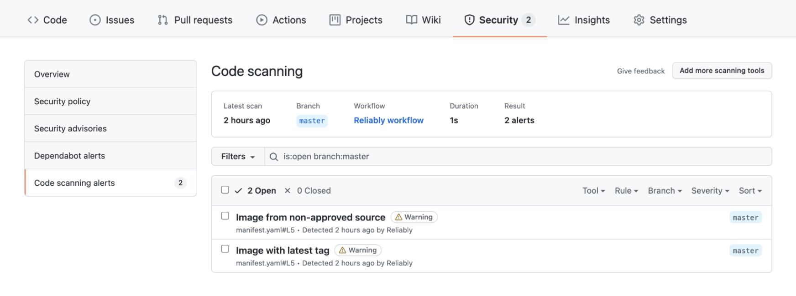

# Add Reliably to your GitHub Workflow

Adding Reliably to your GitHub repositories is as simple as adding a GitHub Workflow with a GitHub Action.

For this walkthrough, we're going to add a fresh workflow to a repository.
However, if you intend to embed this into an existing workflow, you can simply
add the `reliably` job as another item in the `jobs` schedule and ensure the
`env` variables are included

:::note Note
  The source code used in this walkthrough is available in this
  [demo repository](https://github.com/reliablyhq/action-demo/)
:::

:::important
  If you aren't working in a public repository, you will need Advanced Security
  enabled. For more information, see the [GitHub Docs][]
:::

[GitHub Docs]: https://docs.github.com/en/get-started/learning-about-github/about-github-advanced-security

In the repository that you want Reliably to work with, you can create a `reliably.yaml`
workflow by using the `reliably workflow --platform github` command. This will
create the following workflow under `.github/workflows`:

```yaml
name: Reliably workflow

on: push

env:
  RELIABLY_TOKEN: ${{ secrets.RELIABLY_TOKEN }}
  RELIABLY_ORG: ${{ secrets.RELIABLY_ORG }}

jobs:
  reliably:
    runs-on: ubuntu-latest
    steps:
      - name: 'Checkout source code'
        uses: actions/checkout@v2
      - name: 'Run Reliably'
        uses: reliablyhq/actions/scan@v1
        continue-on-error: true
        with:
          format: "sarif"
          output: "reliably.sarif"
      - name: Upload result to GitHub Code Scanning
        uses: github/codeql-action/upload-sarif@v1
        with:
          sarif_file: reliably.sarif

```

You should now have the following in your repository (along with any other files
you already had):

```text
.github
└── workflows
    └── reliably.yaml
```

This workflow describes that GitHub should:

1. Listen for any pushes
2. Run a new job using the `ubuntu-latest` image
3. Checkout the source code using GitHub's own `actions/checkout@v2` action
4. Run Reliably's GitHub Action and output errors to a `reliably.sarif` file
5. Upload the `reliably.sarif` file to GitHub Code Scanning

:::note Note
  [GitHub Code Scanning][] is a GitHub feature which groups potential vulnerabilities
  in the Security tab of your repository
:::

[GitHub Code Scanning]: https://docs.github.com/en/code-security/code-scanning/automatically-scanning-your-code-for-vulnerabilities-and-errors

Make sure that your new workflow has been committed and pushed to GitHub. Once
you've pushed the changes, navigate to the `Actions` tab on your repository on
GitHub and you should see that your new workflow has been added:


The Action will have automatically run as it runs on a `push` command which you
just used to put the workflow to GitHub. However, it will fail because, currently,
it doesn't have access to either your Reliably Access Token or Organization.
This is where GitHub secrets come into hand

## Setup Secrets

For the workflow to be able run the Reliably Action, it requires your Reliably
Access Token and Organization. To avoid exposing secure information within your
workflow file, we advise that these values are stored as GitHub Secrets.

You can retrieve both the Access Token (aka API key) and Organization by using
the `cat ~/.config/reliably/config.yaml` command:

```reliably
<span class="token dollar"></span>cat ~/.config/reliably/config.yaml
```

<CopyToClipboard />

```reliably
auths:
    reliably.com:
        token: {Access Token}
        username: your-username
currentOrg:
    name: {Organization}
    id: an-org-id
```

The Access Token should be stored as a secret with name `RELIABLY_TOKEN` and the
Organization as one with name `RELIABLY_ORG` to match the workflow environment
variables. You may choose to use alternative names but be sure to update the
workflow environment variables accordingly

To add these secrets to your GitHub repository, go to Settings > Secrets >
New repository secret or follow the [documentation][secrets]:

[secrets]: https://docs.github.com/en/actions/reference/encrypted-secrets


## Trigger your new Reliably workflow

Once you've added these values as secrets, you can trigger this workflow by
committing and pushing a `manifest.yaml` file to the root of your repository. Do
this now with a `manifest.yaml` file that contains the following:

```yaml
apiVersion: v1
kind: Namespace
metadata:
  name: reliably
---
apiVersion: v1
kind: Pod
metadata:
  name: chaostoolkit
  labels:
    app: chaostoolkit
spec:
  restartPolicy: Never
  containers:
  - name: chaostoolkit
    image: chaostoolkit:latest
```

This `manifest.yaml` file has been specifically written to trigger some of
Reliably's Suggestions. You should now have the following in your repository
(along with any other files you already had):

```text
manifest.yaml
.github
└── workflows
    └── reliably.yaml
```

Again, make sure you've committed and pushed your changes to GitHub on your root
branch. Once you have pushed your changes, head on over again to the `Actions`
tab on your repository in GitHub and you should see that an action has been
triggered, or even completed:


As you will see, the workflow will pass this time. To view the results of the
Code Scanning, head over the Security tab of your repository and look under
`Code scanning alerts`:



As you can see, there are two scanning issues detected:

1. The indicated image, `chaostoolkit:latest` comes from an untrusted registry.
2. The usage of `Latest` for tags is forbidden.

These issues *could* lead to reliability problems if you were
to apply this manifest to your system.

Each alert is displayed in the context in which it was triggered which, in this
example, was the `manifest.yaml` file.


:::note Note
  Currently, the highlighted line shows the beginning of the resource. It is
  soon intended to be the precise line of the suggestion in the source code.
:::
