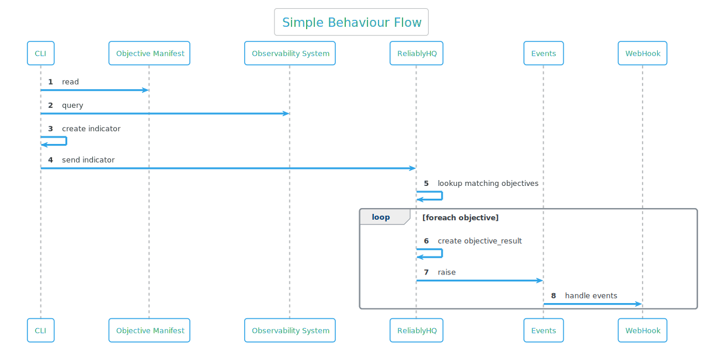

# Objectives, Indicators, Results and Behaviour

The Reliably ecosystem is constructed of these 4 elements. Using instances of each of these entities we are able to help you understand and react to the current state of your systems, as well as systems that you depend upon.

## Everything is an entity

Within Reliably, every single thing you tell us is defined as an `entity`. An entity has identity, and it also has 0 or more relationships to other entities, but it also cannot be created directly - its more like a `base class` (but not by us, since we work with Golang :D). What this means is that it is possible for any information in Reliably to relate to any other information in reliably. This is incredibly valuable when invoking behaviour - I'll explain more about this later in this article.

## Lets talk about structure

Structure is everything! It defines everything about the types of thing we work with. Lets draw a picture of some of our most common entities.

**At Reliably we love the idea of declarative syntax, so every single type that you are likely to use can be defined as an entity in yaml, so thats what I'll use to diagram this structure.**

### Metadata

We can't really go much farther without talking about *metadata*. At Reliably, metadata is used both to convey identity and purpose. The `labels` of metadata define a single identifiable entity by explaining what the entity does, who owns it, where it lives, etc.

Metadata is also where we define what this entity relates to. We dive deeper into relationships later, but its awesome!

### Objective

A Service Level *Objective* defines what good looks like for some aspect of your system.

```yaml
apiVersion: reliably.com/v1
kind: objective
metadata:
    labels: map<string, string>
    relatedTo: map<string, string>
spec:
    indicatorSelector: map<string, string>
    objectivePercent: <number>
    window: <time>
```

### Indicator

A Service Level *Indicator* shows how an aspect of the system has performed between 2 points in time.

```yaml
apiVersion: reliably.com/v1
kind: indicator
metadata:
    labels: map<string, string>
    relatedTo: map<string, string>
spec:
    from: <datetime>
    to: <datetime>
    percent: <number>
```

### Result

A *Result* shows the delta of objective performance vs. actual performance.

```yaml
apiVersion: reliably.com/v1
kind: objective_result
metadata:
    labels: map<string, string>
    relatedTo: map<string, string>
spec:
    indicatorSelector: map<string, string>
    objectivePercent: <number>
    actualPercent: <number>
    remainingPercent: <number>
```

## Simple behaviour sequence



## Relationships

Entities at Reliably all have the ability to be related to other entities based on the labels that define those entities. As  however, entity relationships at Reliably are always calculated at runtime - we don't require certain things to relate to other things, we allow the user to define a relationship at any point, and then we use that relationship accordingly.

### Labels & Relationships

A relationship is defined as a collection of labels that one entity is interested in, that may belong to 0 or many other entities.

Since this relationship is 'loosely enforced' we evaluate it at runtime whenever we trigger behaviour that may need to understand a relationship graph (a good example of this is when the Slack connector is
required to send a message to you when an objective you are 'related to' on changes).

#### Relationship rules

**Each of the properties of the relationship selector must match a label of candidate entity.**

What this means is that only if each key/value pair in the `relatedTo` selector matches a `label` in a given entity will a relationship exist.

It is not possible to have a 'partial match' where only a subset of the `relatedTo` selector properties match labels.

It is possible for the candidate entity to have more labels than any given `relatedTo` selector requires. So long as *all properties of the selector* are matched, the relationship will exist.

It is not possible to have a relationship where the candidate entity has fewer `labels` than a `relatedTo` selector requires.

### Relationship direction

Relationships can be single-direction, or bi-directional. What we mean by this is that an entity can be related to another entity, and thats the end of it. It also possible for an entity to be related to another entity that in turn relates back to the first entity. This is a case we handle when generating the relationship graph at runtime. We ensure that an entity may only appear in the graph once.

### Temporal coupling

Relationships do not have temporal coupling. It is possible to declare the criteria for a relationship long before any other entity satisfies it. It is also possible to declare a relationship after the rest of the entity landscape has settled.

### When relationships break down

It is possible for relationships to be broken. If an entity that previously had a relationship is deleted, or has its `labels` changed then it may no longer satisfy the requirements for a relationship to exist.

It is also possible that a `relatedTo` selector could be changed, and that would impact the graph of related entities.

*We are working on a way to simulate and visualise the relationships of a given entity. Watch this space!*
